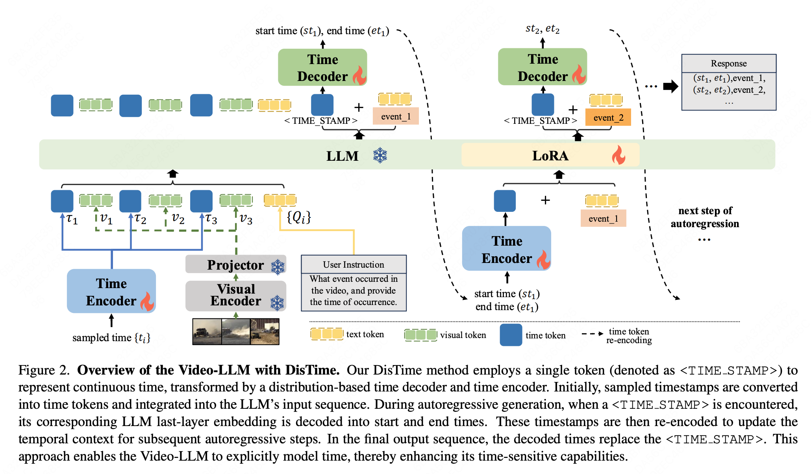
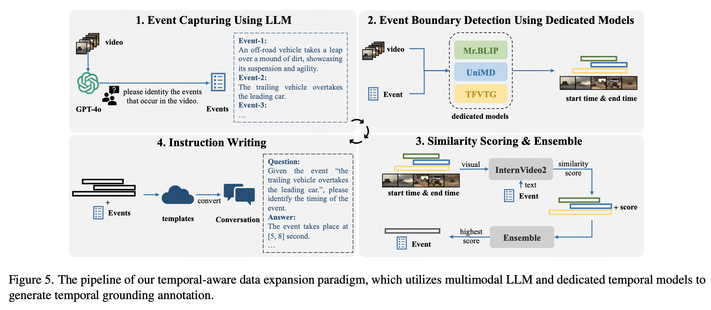

[ICCV2025] DisTime: Distribution-based Time Representation for Video Large Language Models
===

<a href='https://arxiv.org/abs/2505.24329'></a> <a href='https://huggingface.co/datasets/yingsen/internvid-tg'>
[](https://github.com/josephzpng/DisTime)


This is the implementation of Paper: [DisTime: Distribution-based Time Representation for Video Large Language Models](https://arxiv.org/abs/2505.24329) (ICCV 2025).

<div align="center">
  
</div>

## Installation

Please refer to  [INSTALLATION](https://github.com/OpenGVLab/InternVL/blob/main/INSTALLATION.md)

## Models and Data

### Models  
- [DisTime-1B](https://huggingface.co/UserJoseph/DisTime-1B)
- [DisTime-8B](https://huggingface.co/UserJoseph/DisTime-8B) 

### InternVid-TG

In this paper, we propose an automated annotation paradigm that combines the captioning capabilities of Video-LLMs with the localization expertise of dedicated temporal models. With these methods, we construct the InternVid-TG dataset. The dataset is released at https://huggingface.co/datasets/yingsen/internvid-tg.

<div align="center">
  
</div>


## Data construction

```python
{"video": "xxx.mp4", "tgt": [11.39, 31.65], "conversations": [{"from": "human", "value": "<video>\nGive you a textual query: 'They subsequently apply wax to a ski in the kitchen, all the while remaining active and on the move.'. When does the described content occur in the video? Please return the timestamp."}, {"from": "gpt", "value": "The event is depicted at <TIME_STAMP>."}]}

{"video": "xxx.mp4", "tgt": [0, 44, 45, 57, ...], "conversations": [{"from": "human", "value": "<video>\nIdentify and localize a series of steps or actions occurring in the video, providing start and end timestamps and related descriptions."}, {"from": "gpt", "value": "<TIME_STAMP>, clean the bananas. <TIME_STAMP>, take the skin off. <TIME_STAMP>，..."}]}
```

## Training

```bash
# InternVL2.5-1B
sh internvl_chat/shell/distime/internvl2_5_1b_dynamic_res_merged_stage_finetune_lora.sh

# InternVL2.5-8B
sh internvl_chat/shell/distime/internvl2_5_8b_dynamic_res_merged_stage_finetune_lora.sh
```

## Evaluation

### Moment Retrieval 

#### Charades-STA

```python
# evaluate
GPUS=8 sh internvl_chat/evaluate.sh checkpoint/DisTime/DisTime-InternVL2_5-1B charades

# metric
python internvl_chat/eval/charades-sta/charades_sta_eval_utils.py
```

#### ANet

```python
# evaluate
GPUS=8 sh internvl_chat/evaluate.sh checkpoint/DisTime/DisTime-InternVL2_5-1B anet

# metric
python internvl_chat/eval/anet/anet_eval_utils.py
```

#### QVHighlight

```python
# evaluate
GPUS=8 sh internvl_chat/evaluate.sh checkpoint/DisTime/DisTime-InternVL2_5-1B qvh

# metric
python internvl_chat/eval/qvhighlight/qvhighlight_eval_utils.py
```

### Dense Video Captioning

#### YouCook2_dvc

```python
# evaluate
GPUS=8 sh internvl_chat/evaluate.sh checkpoint/DisTime/DisTime-InternVL2_5-1B youcook2_dvc

# metric
python internvl_chat/eval/youcook2_dvc/dvc/eval_dvc.py --pred_file internvl_chat/results/YouCook2-DVC/1B/results.json --gt_file internvl_chat/data_example/youcook2_dvc/val.caption_coco_format.json
```

#### ANet_dvc

```python
# evaluate
GPUS=8 sh internvl_chat/evaluate.sh checkpoint/DisTime/DisTime-InternVL2_5-1B anet_dvc

# metric
python internvl_chat/eval/anet_dvc/metric/anet_dvc_eval_utils.py --data_path internvl_chat/data_example/anet/val_2.json --log_path internvl_chat/results/ANet-Caption-DVC/1B/results.txt --task captioning
```

### Grounded Video Question Answering

#### NExT-GQA

```python
# evaluate stage1
GPUS=8 sh internvl_chat/evaluate.sh checkpoint/DisTime/DisTime-InternVL2_5-1B nextgqa 1

# evaluate stage2
GPUS=8 sh internvl_chat/evaluate.sh checkpoint/DisTime/DisTime-InternVL2_5-1B nextgqa 2

# process result
python internvl_chat/eval/nextgqa/process_and_split.py

# evaluate GQA metric
python internvl_chat/eval/nextgqa/nextgqa_eval_utils.py

# evaluate QA metric
python internvl_chat/eval/nextgqa/evaluate_nextgqa.py
```

### General Video Understanding

#### MVBench

```python
# evaluate and metric
GPUS=8 sh internvl_chat/evaluate.sh checkpoint/DisTime/DisTime-InternVL2_5-1B mvbench
```

#### LongVideoBench

```python
# evaluate and metric
GPUS=8 sh internvl_chat/evaluate.sh checkpoint/DisTime/DisTime-InternVL2_5-1B longvideobench
```

## Citation

```
@article{zeng2025distime,
  title={DisTime: Distribution-based Time Representation for Video Large Language Models},
  author={Zeng, Yingsen and Huang, Zepeng and Zhong, Yujie and Feng, Chengjian and Hu, Jie and Ma, Lin and Liu, Yang},
  journal={arXiv preprint arXiv:2505.24329},
  year={2025}
}
```


## Acknowledgement

DisTime is developed with  the codebases of the following projects: [InternVL](https://github.com/OpenGVLab/InternVL) and [LLaVA-NeXT](https://github.com/LLaVA-VL/LLaVA-NeXT). We would like to express our sincere gratitude to these open-source contributions, which have greatly facilitated our research and exploration of time representation for video large language models.


